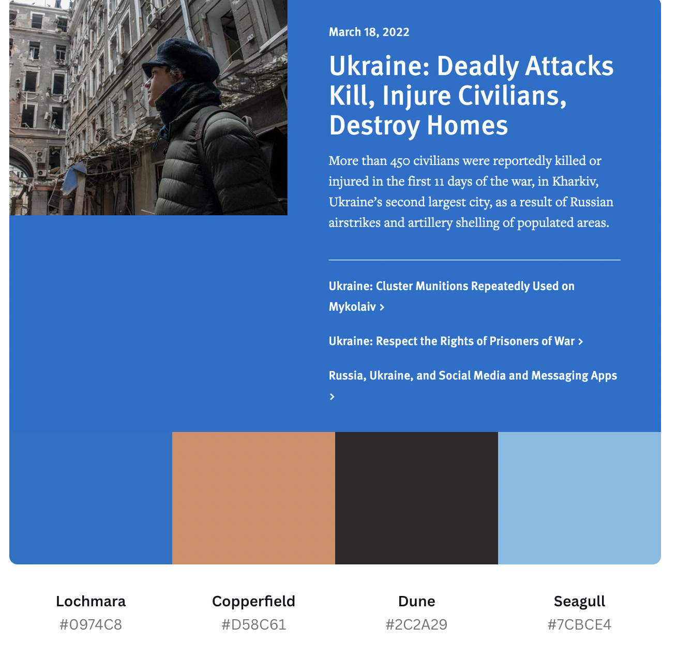
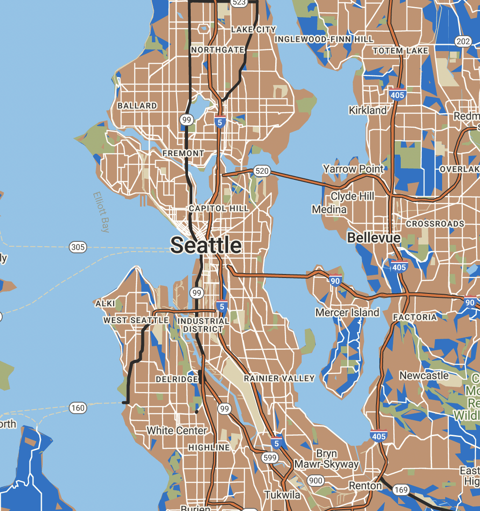
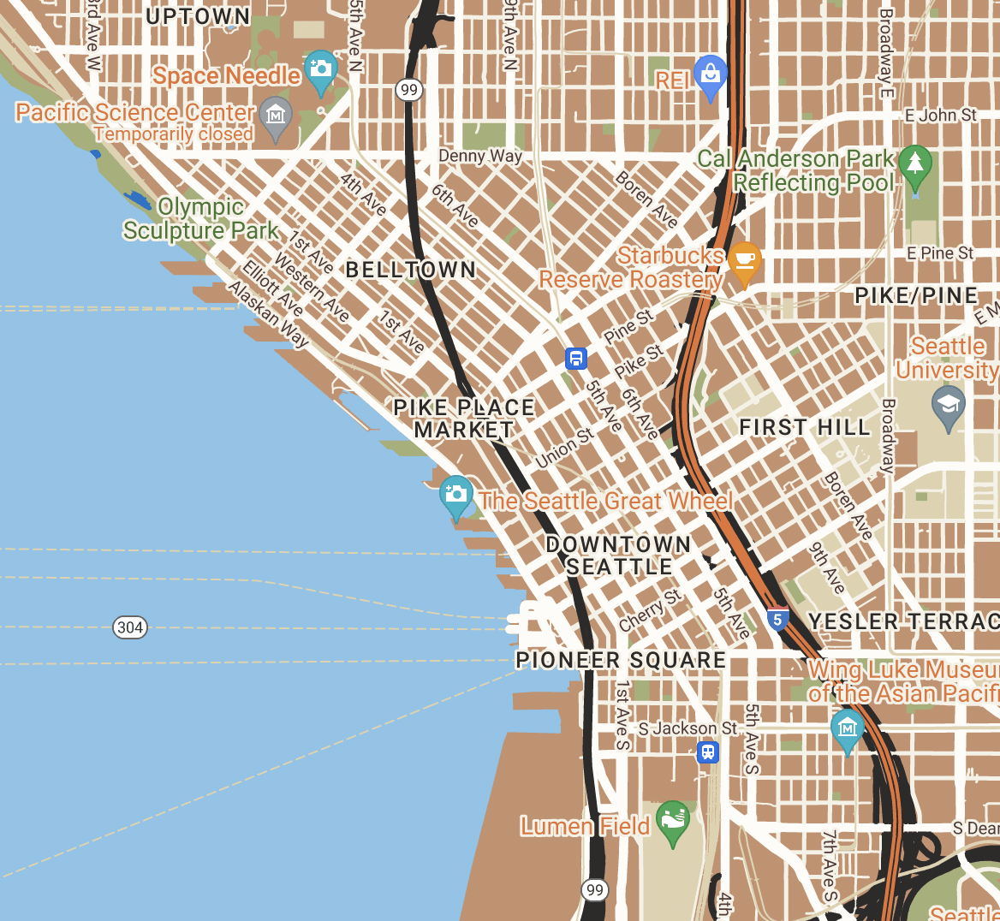

# JSON Code

[
  {
    "elementType": "geometry",
    "stylers": [
      {
        "color": "#c6916d"
      }
    ]
  },
  {
    "elementType": "labels.text.fill",
    "stylers": [
      {
        "color": "#523735"
      }
    ]
  },
  {
    "elementType": "labels.text.stroke",
    "stylers": [
      {
        "color": "#f5f1e6"
      }
    ]
  },
  {
    "featureType": "administrative",
    "elementType": "geometry.stroke",
    "stylers": [
      {
        "color": "#c9b2a6"
      }
    ]
  },
  {
    "featureType": "administrative",
    "elementType": "labels.text.fill",
    "stylers": [
      {
        "color": "#2c2a28"
      }
    ]
  },
  {
    "featureType": "administrative.land_parcel",
    "elementType": "geometry.stroke",
    "stylers": [
      {
        "color": "#dcd2be"
      }
    ]
  },
  {
    "featureType": "administrative.land_parcel",
    "elementType": "labels.text.fill",
    "stylers": [
      {
        "color": "#ae9e90"
      }
    ]
  },
  {
    "featureType": "landscape.natural",
    "elementType": "geometry",
    "stylers": [
      {
        "color": "#0974c8"
      }
    ]
  },
  {
    "featureType": "poi",
    "elementType": "geometry",
    "stylers": [
      {
        "color": "#dfd2ae"
      }
    ]
  },
  {
    "featureType": "poi",
    "elementType": "labels.text.fill",
    "stylers": [
      {
        "color": "#e57235"
      }
    ]
  },
  {
    "featureType": "poi.park",
    "elementType": "geometry.fill",
    "stylers": [
      {
        "color": "#a5b076"
      }
    ]
  },
  {
    "featureType": "poi.park",
    "elementType": "labels.text.fill",
    "stylers": [
      {
        "color": "#447530"
      }
    ]
  },
  {
    "featureType": "road",
    "elementType": "geometry",
    "stylers": [
      {
        "color": "#f5f1e6"
      }
    ]
  },
  {
    "featureType": "road.arterial",
    "elementType": "geometry",
    "stylers": [
      {
        "color": "#fdfcf8"
      }
    ]
  },
  {
    "featureType": "road.highway",
    "elementType": "geometry",
    "stylers": [
      {
        "color": "#2c2b2a"
      }
    ]
  },
  {
    "featureType": "road.highway.controlled_access",
    "elementType": "geometry",
    "stylers": [
      {
        "color": "#e57235"
      }
    ]
  },
  {
    "featureType": "road.highway.controlled_access",
    "elementType": "geometry.stroke",
    "stylers": [
      {
        "color": "#2c2a28"
      }
    ]
  },
  {
    "featureType": "road.local",
    "elementType": "labels.text.fill",
    "stylers": [
      {
        "color": "#806b63"
      }
    ]
  },
  {
    "featureType": "transit.line",
    "elementType": "geometry",
    "stylers": [
      {
        "color": "#dfd2ae"
      }
    ]
  },
  {
    "featureType": "transit.line",
    "elementType": "labels.text.fill",
    "stylers": [
      {
        "color": "#8f7d77"
      }
    ]
  },
  {
    "featureType": "transit.line",
    "elementType": "labels.text.stroke",
    "stylers": [
      {
        "color": "#ebe3cd"
      }
    ]
  },
  {
    "featureType": "transit.station",
    "elementType": "geometry",
    "stylers": [
      {
        "color": "#dfd2ae"
      }
    ]
  },
  {
    "featureType": "water",
    "stylers": [
      {
        "color": "#7cbce3"
      }
    ]
  },
  {
    "featureType": "water",
    "elementType": "geometry",
    "stylers": [
      {
        "color": "#7cbce3"
      }
    ]
  },
  {
    "featureType": "water",
    "elementType": "geometry.fill",
    "stylers": [
      {
        "saturation": 10
      },
      {
        "lightness": 10
      }
    ]
  },
  {
    "featureType": "water",
    "elementType": "labels.text.fill",
    "stylers": [
      {
        "color": "#92998d"
      }
    ]
  }
]

# Color Palette from Human Rights Watch

# Map Scheme

# Summary

I chose the organization Human Rights Watch because I interned there a few summers ago. I found my color palette from a screenshot of the homepage of the website. When I went into the google map builder I knew I wanted to use the beige color as my most utilized ground layer. The lighter blue then replaced the original water feature color. I chose to use the darker blue as the natural landscapes. In order to make the major highways pop against the beige I used the dark gray and I incorporated the bright orange that was not in my color palette but is one of the brand colors for HRW for other less major roadways and for the text color for Points of Interest. Finally I used a cream color for the local roadways so that it stood out against the beige but was not too distracting. 

# Interactive Map

unable to include interactive map because Google refused to process any payment information even though there was no charge... Can't get access to 
API Key.

